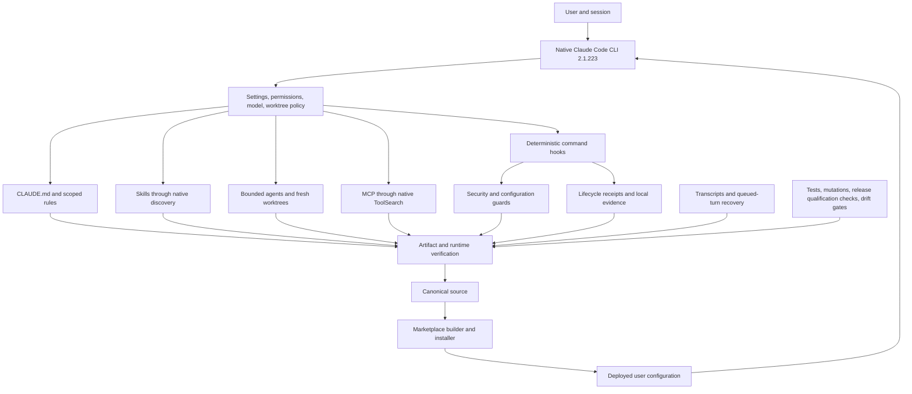

# Claude Code Architecture Review — 2026-08-05

> **Report provenance:** The original body below is a frozen record of the
> 2026-08-06 qualification. It preserves its measurements and delivery claims
> exactly as historical evidence. The dated addendum distinguishes current
> repository policy from that snapshot.

## Current-state addendum — 2026-08-09

This report remains useful as a record of how the architecture was modernized,
but it is not present-state authority on its own. The qualified implementation
`e0681256`, live merge `520e18e7`, 271 assertions, 235 mutations, transcript
aggregates, cost measurements, and file counts below are measurements frozen on
2026-08-06. They must not be read as claims about current `main`.

The delivery and policy state changed after the snapshot:

- [PR #1937](https://github.com/brandyn-s/claude-harness/pull/1937)
  closed unmerged; its historical report branch therefore never became current
  `origin/main`.
- [PR #1938](https://github.com/brandyn-s/claude-harness/pull/1938)
  merged the Claude Code 2.1.226 version floors and peer-machine isolation.
- [PR #1948](https://github.com/brandyn-s/claude-harness/pull/1948)
  merged the full current-runtime reconciliation at merge commit
  `1e7a5cc7ee53c2c5f0429b2b500041a6b809a7de`. Its landed tree matches the
  reviewed PR head; it is no longer an open or draft delivery.
- [PR #1949](https://github.com/brandyn-s/claude-harness/pull/1949)
  terminally merged the context-budget and current-platform reconciliation at
  `8d76d4534b5db11200543cb70d136da427385a4a`.
- [PR #1950](https://github.com/brandyn-s/claude-harness/pull/1950)
  terminally merged the stronger installed-guard, lifecycle, provenance, and
  marketplace reconciliation at
  `9d810b9b6ca9dc03e6434147804eed8221c7e3c9`. Current `origin/main` contains
  that verified behavioral release; a protected source merge is not evidence
  of installed apply.
- Automatic updates are now intentionally enabled. The old manual-only policy
  and `DISABLE_AUTOUPDATER=1` recommendation are superseded. Repository policy
  leaves all update-blocking variables unset, while `minimumVersion: 2.1.226`
  prevents downgrades and the managed template's
  `requiredMinimumVersion: 2.1.226` expresses a separate startup floor.
- Qualification-producing workflows now require requested/effective runtime
  receipts through a model-independent contract and mark any unobserved field
  `<unavailable>`. Opus 4.7 guidance remains only as a historical baseline; it
  is no longer an ambient default.
- Current source preserves the user's explicit `/model` selection,
  `us.anthropic.claude-opus-5[1m]`, uses `effortLevel: high`, leaves
  `alwaysThinkingEnabled: true`, and permits typed safeguard-driven switching
  with `switchModelsOnFlag: true`. These values supersede any present-tense
  model-control statement in the frozen body below.
- Native Claude Code 2.1.226 passed bounded loopback qualification for the
  `git push`/`git commit` `if` hook filters, worker Bash exposure, and the
  cross-checkout worktree fence. Restrictive cross-session settings are now
  schema-checked and CI-gated.
- The removed per-session cap and legacy concurrent-subagent variable are not
  restored: `CLAUDE_CODE_MAX_SUBAGENTS_PER_SESSION` was removed upstream and
  `CLAUDE_CODE_MAX_CONCURRENT_SUBAGENTS` is no longer the documented
  concurrency contract. Current source instead requires
  `CLAUDE_CODE_MAX_SUBAGENT_SPAWN_DEPTH=1` as defense in depth. All six active
  agents deny or omit `Agent`, which is the primary control. Bug #84974 makes
  depth 1 off by one on Claude Code 2.1.225/226, so the setting permits at most
  one child layer if that tool is later granted; no current workflow depends on
  nested worker dispatch.
- Large active skills now carry an early post-compaction recovery contract for
  Claude Code's 5,000-token-per-skill / 25,000-token-combined reattachment
  limits. The atomic marketplace release now closes declared transitive skill,
  shared-policy, and executable-helper dependencies without relying on
  `~/.claude` being a source checkout. Two consecutive release builds were
  byte-identical, and isolated cached-plugin runtime smokes passed.
- The current reconciliation restores stranded clean-ahead, vendor-contract,
  context-measurement, and runtime-model safeguards on top of current
  `origin/main`. Its final verification and GitHub delivery state belong in
  this addendum, not in the frozen figures below.

Any present-tense runtime, delivery, package-count, or model-control sentence in
the historical snapshot is evidence of the 2026-08-06 state only. This addendum
is authoritative for the current reconciliation.

### Ambient-rule reconciliation — 2026-08-09

Current `main` had regressed to 34 unscoped rules totaling 526,404 bytes. The
reconciled source contains 33 always-loaded rules totaling 152,949 bytes
(~38,237 `chars/4` proxy tokens): 373,455 fewer bytes, or a 70.9% reduction.
This is 8,291 bytes (5.7%) above the previously qualified installed 144,658-byte
baseline because newer safeguards were preserved in compact form and the
metric-based shipping contract correctly remains global: its trigger is a
production decision, not an `eval/` pathname. Detailed rationale moved to
on-demand references.

The repository now fails closed when the corpus cannot be measured and blocks
growth above 250,000 bytes in CI, local preflight, and the active rule-edit
guard. Top-level path-scoped rules and nested incident references are excluded;
malformed frontmatter, invalid UTF-8, and escaping symlinks are infrastructure
failures rather than silent undercounts. The 50,000–60,000-byte band remains an
informational A/B target, not a hard gate.

The skill-listing recommendation also needs a current inventory: source now has
107 skills, 7 hidden from model discovery, no truncated listings, an estimated
17,963 listing tokens, 26 skills over the soft body cap, 41 over the
compaction-reattachment proxy, zero continuity gaps, and
`skillListingBudgetFraction: 0.03`. The quoted 112-skill / 1% state described
the older installed configuration, not current source.

### Source, remote, and installed state — 2026-08-09

| State | Rule context | Runtime-policy summary |
|---|---:|---|
| Verified behavioral source release `9d810b9b` | 33 rules / 152,949 bytes | Contained in current `origin/main`; explicit Opus 5 1M provider-prefixed default, `high`, switching enabled, 2.1.226 source floor, 3% skill-listing budget, and depth-1 defense in depth. |
| Installed pre-activation baseline `~/.claude@a8ce4e54` | 32 rules / 144,658 bytes | The prior Fable 5 / 2.1.223 policy is the last committed live baseline; concurrent owner changes are not deployment evidence. |
| Scoped installed deployment candidate | 33 rules / 152,949 bytes in the tested rule scope | Prepared against the preserved installed lineage. Source-only marketplace publication is outside the bounded apply; activation and parity remain unclaimed. |

[PR #1949](https://github.com/brandyn-s/claude-harness/pull/1949)
landed at `8d76d4534b5db11200543cb70d136da427385a4a`, followed by
[PR #1950](https://github.com/brandyn-s/claude-harness/pull/1950)
at `9d810b9b6ca9dc03e6434147804eed8221c7e3c9`. Both protected source
deliveries are terminal; no source/installed parity is claimed by this report.

### Current reconciliation ledger

| Area | Current action | Why |
|---|---|---|
| Update policy | Keep automatic updates enabled; gate all blocker variables and align both 2.1.226 floors. | Honors the later explicit policy without retaining a validator that silently reverses it. |
| Cross-session boundary | Refuse inbound dialogs, expire them after five minutes, isolate peer machines, and validate the schema in CI/preflight. | Preserves collaboration while rejecting unsolicited cross-session delivery. |
| Subagent limits | Reject the removed 50/session and legacy concurrent-subagent variables; require depth 1 as defense in depth. | Every active agent already denies or omits `Agent`; #84974 means depth 1 is an imperfect secondary ceiling of at most one child layer on 2.1.225/226, not a zero-nesting guarantee. |
| Git workflows | Inventory committed, staged, unstaged, and untracked outgoing payloads; distinguish session commits from pre-existing clean-ahead work. | A clean working tree is not evidence that there is nothing to ship. |
| Vendor contracts | Make current first-party contract freshness a blocking validation field. | Regression/smoke results cannot qualify behavior against obsolete platform semantics. |
| Model runtime | Use a model-independent contract plus Fable, Mythos, Opus, and Sonnet overlays; preserve requested/effective model, effort, provider, fallback/switch, refusal, context, and CLI version. | Repository defaults and moving aliases are intent, not provider-observed execution. |
| API examples | Check supported Opus 4.7/4.8 and Claude 5 SDK, JSON, kwargs, dynamic-model, and raw-HTTP request examples against current controls. | Whole-block regexes produced both false positives and false negatives. |
| Multi-agent evidence | Bind roundtable panel and synthesis to one complete run, exact model/effort, valid quorum, terminal state, adequate output headroom, and typed failure receipts. | A crashed, truncated, reused, or sub-quorum run must not emit plausible consensus. |
| Skill lifecycle | Measure native `/context`, `/doctor`, and `/mcp`; add early recovery to active skills above a 4,000-token proxy for the 5,000-per-skill/25,000-combined compaction boundary. | Initial on-demand loading does not guarantee tail instructions survive compaction. |
| Fork arguments | Use native `$ARGUMENTS` rendering and remove the SendMessage/inline fallback. | Claude Code 2.1.226 directly delivered both explicit and auto-appended multiword arguments to a forked skill. |
| Shell guard | Integrate low-noise zsh word-splitting cases as advisory branches in the always-on dialect guard. | Historical replay measured 9/5,648 matches (0.16%); blocking would be disproportionate. |
| Plugin packaging | Close transitive skills, shared assets, helpers, normalized paths, and cached-plugin runtime checks; reject symlink escapes and inactive capabilities. | Strict manifest validation alone does not prove a cached plugin can execute without the source checkout. |
| Evaluation harness | Resolve operational LLM evals from the current repository model and emit nested runtime receipts; freeze Opus 4.7 studies as historical designs. | A stale default can make a green evaluation irrelevant to the deployed model era. |
| Metric-driven shipping | Keep a compact global decision contract and move its full procedure/history on demand. | A production default can be justified by an eval while changing any source path, so path-scoping the gate was a behavioral regression. |
| Output grounding | Treat the PostToolUse hook as an advisory payload diagnostic; require the contract in the four scoped skill prompts and validate sampled outputs through fixtures, replay, and explicit evaluation. | There is no deterministic runtime final-answer enforcement. Thirty-day replay found no substantive final-answer payloads, so hook silence cannot prove compliance. |

### 2026-08-09 context reconciliation — terminal source release

The terminal marketplace versions are `code-intelligence 1.1.14`,
`knowledge-ops 1.1.50`, `planning-toolkit 1.1.30`,
`research-intel 1.1.29`, `safety-net 1.1.29`, and
`security-scanner 1.1.8`. The root marketplace and all six packages passed
strict validation, marketplace synchronization, and the protected
architecture-drift gate.

| Delivery state | Current evidence |
|---|---|
| PR #1949 | **Merged** — terminal merge `8d76d4534b5db11200543cb70d136da427385a4a`. |
| PR #1950 | **Merged** — terminal merge `9d810b9b6ca9dc03e6434147804eed8221c7e3c9`; its landed tree matches the reviewed head. |
| Remote main | **Verified** — current `origin/main` contains `9d810b9b6ca9dc03e6434147804eed8221c7e3c9`; that merge's landed tree matches the reviewed head. |
| Installed `~/.claude` apply | **Pending** — the tested scoped deployment is not active, and no source/live parity is claimed. |

#### Final source qualification through PR #1950

| Gate | Terminal source result |
|---|---|
| Full preflight | 20/20 gates passed. |
| Deterministic skill evals | 270/270 assertions passed. |
| Mutation non-vacuity | All 233 supported mutations bit; 37 counting-only assertions were explicitly skipped. |
| Hosted scripts regression | 542 passed, 10 skipped, 3 subtests passed. |
| Hosted hook regression | 1,650 passed, 60 skipped, 22 subtests passed. |
| Hosted per-skill regression | 2,384 passed, 10 skipped, 32 subtests passed. |
| Focused reconciliation | 76 model, settings, provenance, and deep-dive tests passed in the final local integration check. |
| Native Claude Code 2.1.226 | PR #1949's 8/8 bounded loopback probes passed; PR #1950 preserved the gate and passed protected merge-group validation. |
| Plugin validation | Root marketplace and all six plugins passed strict validation. |
| Marketplace synchronization | Passed. |
| Architecture validation | The protected merge-group workflow completed successfully, including semantic manifests, hook paths, rule budget, telemetry, model-runtime, and drift gates. |
| Secret scan | Gitleaks passed for both protected deliveries. |

<!-- LIVE_ACTIVATION_EVIDENCE_START -->
> **Installed activation is pending.** Replace only this bounded block after a
> stopped-session apply has concrete evidence for the installed commit, rollback
> snapshot or recovery ref, exact scoped inventory, post-apply regression and
> preflight results, native loopback result, and final source/installed drift
> verdict. Until then, no installed parity or deployment-complete claim is made.
<!-- LIVE_ACTIVATION_EVIDENCE_END -->

The PR #1949 committed
[differential review](../claude-config_DIFFERENTIAL_REVIEW_2026-08-09.md),
added at `d7889779`, reviewed the source tip at `5295e30d` and returned
**APPROVE** with **LOW** overall risk. Its one open finding is a nonblocking LOW
near-cap concurrency race: overlapping PreToolUse decisions can validate the
aggregate rule corpus against the same snapshot, so the live 250,000-byte guard
is not an atomic concurrency guarantee. At 152,949 bytes the current corpus has
substantial headroom; the limitation remains tracked rather than treated as a
merge blocker.

### 2026-08-08 reconciliation verification — merged release

The behavioral and package release tip was `7c5af8096446dc12e56cc048d4365b455b76062a`,
14 commits above its reconciled base `origin/main@8e360044`; the report files
first landed in `837646f3`. GitHub later merged that reviewed tree through
[PR #1948](https://github.com/brandyn-s/claude-harness/pull/1948) at
`1e7a5cc7ee53c2c5f0429b2b500041a6b809a7de`. The installed `~/.claude`
checkout was not modified by that merge, which is why source/live reconciliation
remained a separate deployment step.

| Gate | PR #1948 result |
|---|---|
| Full preflight | 19/19 gates passed. |
| Deterministic skill evals | 270/270 assertions passed. |
| Mutation non-vacuity | 233/233 supported mutations were detected; 37 counting-only assertions were explicitly skipped by the mutation engine. |
| Scripts regression | 375 passed, 1 skipped, 3 subtests passed. |
| Hook regression | 1,542 passed, 49 skipped, 22 subtests passed. |
| Native Claude Code 2.1.226 | 8/8 loopback probes passed: settings schema, both fork-argument modes, push nonmatch/block, commit block, worker Bash, and cross-checkout fence. |
| Marketplace release | 1,324 packaged files across six plugins; the 1,332-file package-plus-manifest tree was byte-identical across consecutive builds at SHA-256 `3b6041e8e37aa784477f804ff42ed1e262e7a0dbe05a87a5f208df8845d8dc62`. |
| Plugin validation/runtime | Root marketplace and all six plugins passed Claude Code 2.1.226 strict validation; all 500 packaged Python files compiled; cached healthcheck, distill, audit, guard-block, dependency, symlink/traversal, rollback, and whole-release atomicity smokes passed. |
| Architecture audit | Strict audit passed with zero repository drift, errors, or informational findings; marketplace freshness passed. |
| Zsh replay | 9/5,648 historical commands matched (0.16%); all 29 positive/negative fixtures passed. |

PR #1948 plugin versions were: `code-intelligence 1.1.14`, `knowledge-ops 1.1.44`,
`planning-toolkit 1.1.27`, `research-intel 1.1.20`, `safety-net 1.1.28`, and
`security-scanner 1.1.8`.

### GitHub delivery outcome for PR #1948

- Remote branch: `agent/reconcile-architecture-20260808`
- PR: [#1948 — Reconcile Claude Code architecture with current runtime contracts](https://github.com/brandyn-s/claude-harness/pull/1948)
- State: **merged** at `1e7a5cc7ee53c2c5f0429b2b500041a6b809a7de`
- Publication base: `origin/main@8e360044`
- First published report tip: `837646f3`

The terminal merge proves protected-branch delivery. It does not by itself
prove administrator deployment, live-config synchronization, native-Windows
qualification, or production approval.

Repository policy still does not prove live administrator deployment, shell
environment, or runtime behavior. Each newly installed Claude Code release
requires a fresh-session qualification before a behavior is treated as proven.

## Historical snapshot — evidence frozen 2026-08-06

### Historical verdict

**Status: LOCAL SOURCE AND LIVE macOS DEPLOYMENT QUALIFIED; REMOTE DELIVERY AND
NATIVE WINDOWS PENDING.** The qualified behavioral implementation is
`e0681256`; this report is a documentation-only descendant and does not change
that tested behavior. The live `~/.claude` checkout is deployed at local merge
`520e18e7`, with the qualified implementation merged over the preserved live
parent. All 14 owner-preserved files match the safety branch exactly, and both
source and live trees passed all five direct-qualification checks. The complete
regression, mutation, smoke, marketplace-parity, rollback, and independent
adversarial-review gates pass.

This is a qualified local deployment, not a completed remote release. The
branch has not been pushed, no pull request or hosted checks exist, the change
has not been merged to remote `origin/main`, and native Windows remains
unverified. The administrator-managed version floor and the MDM-owned OTel
content controls also remain outside the deployed repository boundary. No
canary, staged, trial, calendar-wait, or observation-period rollout remains or
is recommended.

The governing principle is now:

> Keep model context short and discoverable; enforce only deterministic
> invariants in hooks; treat platform status, receipts, and transcripts as
> evidence inputs rather than proof of success.

## Architecture layout

The architecture consists of eight layers:

1. **Runtime and policy** — version floor, model/defaults, permissions,
   auto-mode intent, sandbox posture, worktree policy, and environment limits.
2. **Always-on context** — `CLAUDE.md`, scoped rules, platform notes, and small
   memory indexes. These guide the model; they are not security boundaries.
3. **On-demand capability** — skills and agents, loaded through Claude Code's
   native discovery and explicit dispatch rather than a custom keyword router.
4. **External tools** — MCP registrations and native ToolSearch, with status and
   tool-call evidence kept separate from transport connectivity.
5. **Deterministic automation** — command hooks, the `run-hook` dispatcher,
   security guards, ConfigChange protection, and bounded lifecycle receipts.
6. **Evidence and recovery** — acceptance snapshots, transcript/queued-turn
   reconstruction, reversible configuration snapshots, and runtime qualification probes.
7. **Quality gates** — unit, regression, mutation, drift, manifest, skill,
   plugin, installer, and cross-platform checks.
8. **Distribution and deployment** — canonical source, generated marketplace
   packages, the installer, and the live `~/.claude` configuration.

## What was reviewed

### First-party and public evidence

- Anthropic's current best-practices, hooks, permissions, skills, subagents,
  plugins, MCP, and feature-overview guidance.
- Claude Code releases **2.1.129 through 2.1.223**, covering the three-month
  window from 2026-05-06 through the 2.1.223 release on 2026-08-06 UTC.
- The v2.1.223 security and behavior changes, plus first-party GitHub security
  advisories and current issue reports that affect this configuration.
- Sixteen fresh community searches and eighteen deep reads across Reddit,
  practitioner blogs, an empirical paper, indexed X threads, and other forums.
  Community claims were treated as hypotheses until corroborated by first-party
  or local evidence.

Primary references include Anthropic's [best-practices guide](https://code.claude.com/docs/en/best-practices),
[hooks reference](https://code.claude.com/docs/en/hooks),
[permissions reference](https://code.claude.com/docs/en/permissions),
[subagents guide](https://code.claude.com/docs/en/sub-agents),
[plugins reference](https://code.claude.com/docs/en/plugins),
[monitoring reference](https://code.claude.com/docs/en/monitoring-usage), and the
[v2.1.223 release](https://github.com/anthropics/claude-code/releases/tag/v2.1.223).

### Local architecture and runtime evidence

- Qualified behavioral `claude-config` source at `e0681256`: settings, rules, skills,
  agents, hooks, manifests, marketplace builder, installer, CI, architecture
  docs, and tests. The report commit that follows is documentation-only; local
  `main` may therefore point to that descendant without changing the qualified
  implementation tree.
- The live macOS `~/.claude` checkout at merge `520e18e7`. Deployment followed
  the `pre-context-reduction-20260806` rollback snapshot, which captured 239
  files against clean live parent `27620385`. The earlier
  `pre-architecture-direct-qualification-20260806` snapshot remains available.
- The preserved live delta was reconciled, not discarded: all 14 owner files
  match the safety branch exactly. The canonical marketplace contains 893
  payload files across six plugins; the live tree contains 897 because its
  qualified `cc-monitor` owner delta was deliberately retained.
- Claude Code **2.1.223** is the sole installed CLI. Both zsh and bash resolve
  the native binary. `DISABLE_AUTOUPDATER=1` disables silent updates while
  retaining the qualified manual-upgrade path. `claude doctor` reports only
  that this noninteractive automation context cannot write the Keychain; it did
  not identify another install or architecture defect.
- A fixed ten-day transcript snapshot: **134 main sessions + 408 child
  transcripts = 542 transcripts**, plus **39 workflow receipts**.
- Recent behavior: 4/39 completed workflow receipts contained final logical
  errors; 2/39 were entirely failed; all 16 final workflow errors were
  prompt-too-long. Native Agent calls were 8 ordinary completions, 4 desired
  isolation blocks, and 4 context/background failures. Background Skill forks
  were 0/2 successful.
- MCP/ToolSearch behavior: 2,264 MCP calls across 24 active main-session servers
  with 141 errors; 450 ToolSearch calls, 436 of them exact `select:` requests.
  A hard-truncated MCP response was immediately requested again.

## What was not reviewed or proven

- The owner-accepted embedded bearer-token risk was left unchanged. Validity,
  rotation, history rewriting, and downstream access-log review are explicitly
  outside this qualification.
- The transcript census is a fixed ten-day snapshot, not all historical Claude
  sessions. Valid JSONL does not prove that every assistant message was stored.
- Direct X API search was unavailable; three original X URLs were resolved from
  a maintained index and substantive claims were corroborated elsewhere.
- Authenticated Claude.ai/Remote Control state and every live remote-MCP tool
  inventory were not proven from this host session.
- Repository validation proves that the managed-source templates request
  metadata-only OTel. The separately MDM-managed macOS profiles were also
  inspected: they currently enable prompt, assistant-response, tool-detail,
  tool-result, and raw API-body content. Those MDM OTel content flags remain an
  external P0; deploying repository source neither changed nor resolved them.
  Backend receipt and redaction were not independently proven.
  `DISABLE_TELEMETRY=1` is not Anthropic's documented Claude Code OTel kill
  switch and is not used as evidence of OTel state.
- The source managed-settings template declares `requiredMinimumVersion`, but
  that system-managed startup floor is not deployed on this host. The local
  installer/version preflight and `minimumVersion` setting do not substitute
  for administrator deployment of that policy.
- Native Windows behavior remains unproven until the on-demand Windows workflow
  completes. Structural simulations are not a substitute for that run.
- No remote branch, pull request, hosted check, or remote merge was created as
  part of the local deployment.
- Community popularity was not treated as effectiveness. No broad plugin,
  toolkit, hook, or multi-agent framework was adopted from popularity alone.

## Full recommendation ledger

| # | Recommendation | Disposition | Candidate action / remaining gate |
|---:|---|---|---|
| 1 | Pin the minimum Claude Code version to 2.1.223 and sweep advisories separately from the changelog. | ADOPT | Source, installer, CI, and qualification enforce 2.1.223; the sole native install is pinned against silent movement with `DISABLE_AUTOUPDATER=1`, while manual qualified upgrades remain available. The administrator-managed `requiredMinimumVersion` startup floor is still undeployed. |
| 2 | Keep `CLAUDE.md` and always-on rules short, human-readable, and limited to non-obvious invariants and exact commands. | ADOPT | The ambient corpus fell from 442,497 to 144,658 bytes, a 297,839-byte or 67.3% reduction. Full originals remain under `docs/rule-reference/`. |
| 3 | Use native skill discovery/progressive disclosure; remove the custom keyword skill router and prompt injectors. | ADOPT | Custom routing and heavy reminder hooks removed. |
| 4 | Keep native ToolSearch and exact `select:` queries; remove stale rules that forbid ToolSearch. | ADOPT | Interceptor removed; active superplan guidance reconciled with recent usage. |
| 5 | Use Claude Code's native persisted-file behavior for oversized MCP output; do not hard-truncate model-visible results. | ADOPT | Custom MCP output trimmer and 200K override removed. |
| 6 | Distinguish MCP transport connection, auth-needed, disabled, HTTP/connect failure, `tools/list` failure, unknown, and zero-server states. | ADOPT | Acceptance probe now emits sanitized state classes and fails closed on contradictory/unparseable output. |
| 7 | Test critical MCP servers through initialize/list/representative positive and negative calls; stderr alone is diagnostic, not health. | ADOPT | Local parser/harness coverage added; authenticated per-server live calls remain a deployment follow-up. |
| 8 | Replace the global MCP timeout only with measured per-server `request_timeout_ms` exceptions. | DEFER | Keep 60 seconds until p50/p95 data justifies a directly qualified exception. |
| 9 | Manage plugins with supported `claude plugin ...` and marketplace commands. | ADOPT | Internal docs changed; registry/cache edits are disaster recovery only. Canonical packaging is 893 payload files across six plugins; the 897-file live package deliberately preserves `cc-monitor`. |
| 10 | Establish a nonblocking plugin context-cost baseline before enabling more packages or setting a budget. | DEFER | Re-evaluate when a disposable configuration can be measured; do not enable a live package merely to observe it. |
| 11 | Keep hooks thin, deterministic, bounded, and command-based. Do not use model-judgment hooks for enforcement. | ADOPT | Heavy/model-judgment, custom compaction, and routing hooks removed. |
| 12 | Register hooks with one absolute executable plus structured args; do not rely on `HOME`, shell expansion, or ambiguous payload identity. | ADOPT | Installer/runtime wiring and HOME-less qualification checks added; POSIX and Git-Bash forms are explicit. |
| 13 | Protect mutable settings with a synchronous ConfigChange guard whose own registration cannot be silently removed or weakened. | ADOPT | User/project/local settings fail closed; policy settings remain advisory by design. |
| 14 | Snapshot `settings*`, hook/agent state, and global `~/.claude.json` before consequential config changes; make restore reversible and integrity checked. | ADOPT | Transactional rollback and adversarial tests pass. The 239-file `pre-context-reduction-20260806` snapshot pins clean live parent `27620385`; the earlier pre-architecture snapshot is also retained. |
| 15 | Treat permission `ask` as an interaction feature, not a durable security boundary in background/child/desktop contexts. | ADOPT | No `ask` rules; deterministic restrictions/guards remain the boundary. |
| 16 | Preserve worktree isolation, pin fresh bases, verify resolved path/HEAD/status, and never auto-delete dirty worktrees. | ADOPT | `baseRef: fresh`, dispatch guard, and release checks retained. |
| 17 | Use one primary bounded child-execution contract; keep depth 1, small workflow guidance, concurrency/session limits, and heavy-mode exceptions. | ADOPT | Native limits configured; broad ambient Agent-team fan-out rejected. |
| 18 | Do not assume a child inherits remote MCP tools/authentication. Require a current-session harmless child MCP qualification probe. | ADOPT | Active research skill guidance corrected; the direct authenticated probe remains situational. |
| 19 | A workflow/agent is successful only when every expected logical result, required schema, artifact, test, and runtime state is verified. | ADOPT | Documentation and downstream acceptance changed; native receipt wording alone is never the oracle. |
| 20 | Record requested and effective child model/effort separately. | ADOPT | Architecture contract updated; 2.1.223 warnings help detect restricted-model fallback. |
| 21 | Remove background Skill forks as a default execution layer until context transfer is bounded. | REJECT | Fork override removed from the affected heavy skill; observed local result was 0/2 successful. |
| 22 | Treat transcripts as primary but not guaranteed complete; recover queued turns and verify against artifacts/runtime. | ADOPT | Evidence language, queued-turn recovery, schemas, and mutation tests added. |
| 23 | Keep SessionStart cheap and SessionEnd receipts local; remove duplicate ledger/compaction/prompt-rehydration machinery. | ADOPT | Lifecycle architecture simplified and receipt location isolated from source. The exact live smoke produced a schema-v3 receipt whose enrichment completed and whose runtime evidence is honestly `partially-enriched`. |
| 24 | Make every release qualification executable: exact version, static contracts, HOME-less hooks, ConfigChange behavior, worktree identity, full-tree nonmutation, and Git index state. | ADOPT | Source and deployed live trees each passed 5/5 direct checks. |
| 25 | Include content, ownership, modes, BSD flags, ACLs, xattrs, root metadata, and logical Git state in nonmutation evidence; exclude `.git` internals. | ADOPT | macOS-native metadata tests added after adversarial review. |
| 26 | Run periodic transcript-backed, reversible architecture checkups; delete only after source/usage/negative-test evidence. | ADOPT | Health, drift, context-budget, and transcript review remain recurring controls. |
| 27 | Enable the Claude sandbox only after disposable-environment qualification proves workflow, egress, and false-positive behavior. | DEFER | Current host remains explicitly unsandboxed. There is no staged ring: qualify fully and enable directly, or leave it off. |
| 28 | Prefer the native Claude Code installer, especially on Windows; retain npm only as a qualified fallback. | ADOPT | Installer/version preflight and platform workflow cover the supported floor. |
| 29 | Evaluate security-guidance or other community plugins individually with A/B findings, latency, cost, false positives, and egress review. | DEFER | Re-evaluate when an isolated disposable configuration and native Windows host are available; no broad or observational live install. |
| 30 | Defer OTel MCP/plugin schema changes until one isolated authenticated event proves fields, joins, and redaction. | DEFER | Source templates request metadata-only logging. MDM-owned profiles still enable content and remain an external P0; backend receipt remains unverified. |
| 31 | Do not automatically clean native dirty worktrees or let a model-issued boolean stand in for destructive user authorization. | REJECT | Cleanup stays conservative and independently verified. |
| 32 | Do not treat `CLAUDE.md`, a passing process exit, a connection badge, or a receipt's existence as enforcement/success evidence. | REJECT | Artifact and runtime verification is required. |
| 33 | Do not install another broad community toolkit or enable all ambient packages. | REJECT | Individual measured capability adoption only. |
| 34 | Use a canary, staged promotion, trial, calendar wait, or observation-period rollout for this architecture. | REJECT | No such workflow is retained. Deploy directly only after deterministic qualification, regression, mutation, transcript replay, and fresh-session smoke checks, with a recoverable snapshot. The gather-family's live `TRIAL`/`try-by` path was removed as the same pattern under another name. |
| 35 | Do not keep incomplete hidden skills as dormant architecture. | REJECT | The non-runnable `sca-review` prototype was removed from settings, routing, discovery, and marketplace packaging; its design is archived under `docs/archive/sca-review/`. |
| 36 | Bind evaluation evidence to provider-observed responses, not requested-model intent. | ADOPT | Harnesses distinguish requested and effective model plus fallback/refusal state. They mark unavailable provider or effort fields as partial rather than inventing provenance; missing effective-model evidence remains invalid. |
| 37 | Bind multi-agent synthesis, resume, and quorum to one explicit run identity. | ADOPT | Roundtable rejects stale/nonempty output, stamps records, filters to current-run successes, and aborts when current-round quorum collapses. |
| 38 | Make semantic manifest drift fatal in CI, not merely advisory. | ADOPT | Strict-semantic compilation is wired into CI and a real-corpus mutation proves removal of a prose-only tool exclusion fails the gate. |
| 39 | Package shared runtime policy inside every plugin that references it. | ADOPT | Plugin-relative references replace home-directory paths; the builder copies one canonical shared policy and validates isolated resolution and byte parity. |
| 40 | Fail closed when a task declares a malformed completion contract. | ADOPT | Declared malformed JSON, paths, cwd, or contract shape block completion; truly uncontracted research tasks retain the intentional fail-open behavior. |
| 41 | Keep lifecycle receipts inside the documented hook schema and enrich them offline. | ADOPT | SessionStart seeds the documented model field, SessionEnd consumes only supported fields, and the local-only enricher adds bounded runtime provenance without model or network calls. The live schema-v3 receipt recorded requested/effective Fable 5 with no fallback or refusal; provider and effort were unavailable, so evidence status correctly remains `partially-enriched`. |

## Validation evidence

All commands below exited zero unless a limitation is stated explicitly.

### Regression and contract gates

| Surface | Final local evidence |
|---|---|
| Implementation identity | Qualified behavioral implementation `e0681256`; the report commit is a documentation-only descendant. |
| Hooks | 1,479 passed, 48 skipped, 9 subtests passed. |
| Repository scripts and installer paths | 384 passed, 3 subtests passed. |
| Runtime and rollback utilities | 200 passed. |
| Skills | 2,300 passed, 1 skipped, 29 subtests in a clean exact clone of `9380d5c9`; the skill tree is byte-identical at implementation source `e0681256`. |
| Manifest test entrypoints | 57 passed with both bare `pytest manifests/` and `python3 -m pytest manifests/`. |
| Top-level tests | 27 passed. |
| Strict skill audit | 0 drift, 0 errors, 19 informational findings. |
| Manifest corpus | 194 manifests loaded; structural, routing, and strict-semantic validation passed. |
| Deterministic evals | 271/271 assertions passed. |
| Marketplace | Two consecutive canonical builds were clean: 893 payload files across six plugins. Live has 897 files because the qualified `cc-monitor` owner delta is preserved. |
| Direct release qualification | Source passed 5/5; deployed live macOS passed 5/5. |
| Context budget | The 32-file ambient corpus fell from 442,497 bytes (~110,624 proxy tokens) to 144,658 bytes (~36,164), below the new 225,000-byte warning and 250,000-byte block thresholds. |
| Installed runtime | One native Claude Code 2.1.223 install; zsh and bash resolve it; automatic updates are disabled and manual qualified updates remain available. |
| OTel policy | Source templates are metadata-only and any content flag set to `1` fails validation. The separate MDM-owned macOS profiles were inspected and currently enable full content, so live state is an unresolved external P0; backend delivery remains unattested. |

The new `pytest.ini` makes repository imports independent of how pytest is
launched. The CI-literal `python` executable does not exist on this Mac; the
identical strict-audit command passed under `python3`. That is a host launcher
naming difference, not a code failure. Runtime coverage includes the hardened
compare-and-restore race cases and integrity-checked rollback behavior.

### Mutation, parser, and nonmutation evidence

- The deterministic-eval mutation gate proved 235 assertions bite; 36 counting
  or unresolvable assertions were reported as skipped rather than overstated.
- Independent adversarial review reached **SPEC-CLOSURE: PASS** and **QUALITY:
  PASS** on the runtime source. Parser and grammar coverage includes POSIX and
  Windows quoting, expansion, interpreter/dispatcher identity, wrappers,
  control syntax, malformed structured arguments, and later payload names.
- The manifest strict-semantic mutant, declared-completion mutants, telemetry
  content/state mutants, and provenance-integrity mutants were all rejected.
  Ruff's high-signal checks and `git diff --check` were clean.
- Settings fixtures reject duplicate JSON object keys, and both settings
  surfaces retain exactly one structured ConfigChange registration.
- Claude Code 2.1.223 passed all five full-tree qualification checks against
  both source and live deployment: version floor, static contracts/worktree
  identity, HOME-less SessionEnd, fail-closed ConfigChange, and complete
  repository/Git-index nonmutation.

### Distribution, context, and live smoke evidence

- Two consecutive canonical 893-payload-file marketplace builds passed
  dropped-reference, shared-runtime-policy containment, hook-import, and all
  six plugin validations. The live 897-file package is intentional, not drift:
  deployment preserved the qualified `cc-monitor` owner delta.
- Ambient context fell by 297,839 bytes, or 67.3%, from 442,497 bytes
  (~110,624 proxy tokens) to 144,658 bytes (~36,164). The 20 largest rules fell
  from 395,497 to 97,658 bytes. Their complete originals remain discoverable
  under `docs/rule-reference/`; evidence was moved out of always-on model
  context, not deleted.
- A real **84,794,939-byte** Claude transcript condensed successfully: 182 user
  records, 775 assistant records, 1,212 tool records, 60 errors, three
  compactions, and zero malformed lines. Its 1,061,530-byte signal slice was
  split into three parts, each under the 180,000-token bound; manifest totals
  and per-part limits validated. Disposable outputs were removed afterward.
- Fresh exact Fable 5 smoke session
  `11111111-1111-1111-1111-111111111111` returned exactly
  `CLAUDE_ARCHITECTURE_SMOKE_OK`. It recorded 98,867 cache-creation input
  tokens and cost **$1.97871**.
- The comparable pre-compaction normal measurement was 210,641 tokens and
  **$4.21609**; the safe baseline was 33,354 tokens and **$0.671201**. The
  current architecture therefore reduced measured tokens by **53.06%** and
  cost by **53.07%**. Relative to the safe baseline, customization overhead
  fell from 177,287 to 65,513 tokens, removing **63.05%** of that overhead.
- Its schema-v3 receipt enrichment completed. It records requested and
  effective Fable 5, zero fallback, and zero refusal. Provider and effort were
  unavailable to the transcript enricher, so runtime evidence status is
  correctly `partially-enriched`, not overstated as complete provenance.
- The first direct OAuth attempt failed closed before inference because the
  noninteractive process could not unlock the Keychain: **0 tokens, $0**. The
  exact measured smoke then used the existing Keychain workspace key in-process
  without exposing it.
- Native macOS execution is verified on this host. Windows path/Git-Bash
  behavior is structurally and synthetically covered, but native Windows is
  still **NOT VERIFIED** pending a hosted `windows-2022` run.

### Current delivery state

| State | Evidence |
|---|---|
| Implementation source | Behavioral implementation qualified at `e0681256`; local `main` includes the subsequent documentation-only report commit. |
| Live macOS `~/.claude` | Deployed and qualified at local merge `520e18e7`. |
| Rollback state | `pre-context-reduction-20260806` preserves 239 files pinned to clean live parent `27620385`; the earlier pre-architecture snapshot remains. |
| Owner-preserved state | All 14 owner files match the safety branch exactly. |
| Remote branch / pull request | Not pushed or opened; hosted checks have not run. |
| Remote `origin/main` merge | Not done. |
| Native Windows | Not verified. |
| System-managed version floor | Source template contains `requiredMinimumVersion`; administrator deployment remains pending. |
| MDM OTel content controls | External P0 remains open. |

## Remaining operational follow-ups

The local source architecture and macOS deployment are qualified. The open
items are explicit remote, platform, managed-policy, or runtime measurements;
there is no remaining canary, staged, trial, or time-based rollout step.

1. Push the qualified branch, open the pull request, run hosted checks, and
   merge to remote `origin/main`; keep those states separate until each is
   independently verified.
2. Run the on-demand native `windows-2022` workflow and treat structural or
   synthetic Windows coverage only as supporting evidence.
3. Have the Jamf/MDM policy owner reconcile this host's content-enabled OTel
   profile with the repository's metadata-only policy, then verify a sanitized
   effective startup environment and backend receipt.
4. Have the system policy owner deploy and verify the managed
   `requiredMinimumVersion` startup floor.
5. Collect per-server MCP latency and authenticated critical-server direct probes.
6. Measure plugin context cost in a disposable configuration; do not enable a
   live package merely to wait for usage evidence.
7. Qualify sandbox behavior in a disposable representative environment; enable
   it directly only if every gate passes, otherwise leave the shared default off.
8. Validate current-session remote MCP behavior before any child receives those
   calls.
9. Revisit OTel correlation fields only after an isolated authenticated event.
10. Continue periodic transcript/architecture checkups against the measured
    post-reduction baseline.
