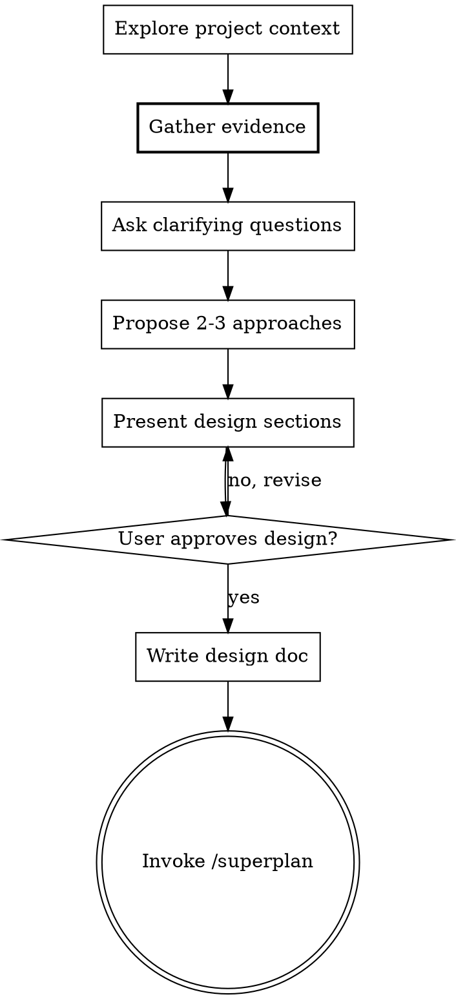

# Brainstorming Ideas Into Designs

> Forked from superpowers v4.3.1. One addition marked with `[EXAMPLE]`.
>
> **Output grounding (REQUIRED READ)**: when proposing designs to a user who is not the domain expert, read `skills/_shared/output-grounding.md` first and apply its three-layer contract (confidence + provenance + counterfactual). That file is NOT ambient — it was relocated out of `rules/` on 2026-08-26 after measuring EXPOSED=0 over 438 transcripts — so it is in context only if you read it. The `creative-output-grounding-check` PostToolUse hook is an advisory payload diagnostic only; it does not grade the later final answer. Skill instructions and final-output evaluation are the primary controls.
>
> **Creativity tradeoff curve**: LLM creativity is constrained on an originality-quality tradeoff (Padmakumar 2025, Salvi 2026), with counter-evidence on emergent symbolic abstract reasoning (Yang ICML 2025) and structured creativity prompting (Chan 2511.07448). Design outputs are drafts subject to user verification, NOT finalized novelty. See `~/Documents/knowledge-base/topics/llm-creativity-ceiling.md`.

## Overview

Help turn ideas into fully formed designs and specs through natural collaborative dialogue.

Start by understanding the current project context, then gather evidence from existing data, then ask questions only for what the data didn't answer. Once you understand what you're building, present the design and get user approval.

<HARD-GATE>
Do NOT invoke any implementation skill, write any code, scaffold any project, or take any implementation action until you have presented a design and the user has approved it. This applies to EVERY project regardless of perceived simplicity.
</HARD-GATE>

## Anti-Pattern: "This Is Too Simple To Need A Design"

Every project goes through this process. A todo list, a single-function utility, a config change — all of them. "Simple" projects are where unexamined assumptions cause the most wasted work. The design can be short (a few sentences for truly simple projects), but you MUST present it and get approval.

## Checklist

You MUST create a task for each of these items and complete them in order:

1. **Explore project context** — check files, docs, recent commits
2. **`[EXAMPLE]` Gather evidence before asking** — answer your own questions from data first
3. **Ask clarifying questions** — only for what the evidence didn't answer
4. **Propose 2-3 approaches** — with trade-offs and your recommendation
5. **Present design** — in sections scaled to their complexity, get user approval after each section
6. **Write design doc** — save to `docs/plans/YYYY-MM-DD-<topic>-design.md` and commit
7. **Transition to implementation** — invoke /superplan to create implementation plan

## Process Flow



**The terminal state is invoking /superplan.** Do NOT invoke frontend-design, mcp-builder, or any other implementation skill. The ONLY skill you invoke after brainstorming is /superplan.

## The Process

**Understanding the idea:**
- Check out the current project state first (files, docs, recent commits)
- Read existing implementations that relate to the request
- **Background exploration**: If the feature touches a codebase area you haven't
  read, spawn an Explore agent in the background (`run_in_background: true`) to
  build context on the relevant files while you continue the conversation with
  the user. This avoids blocking the dialogue while building codebase understanding.
  (Pattern source: mattpocock/skills QA — Context7 registry evaluation 2026-04-05)

**`[EXAMPLE]` Gathering evidence before asking:**

Before asking the user ANY clarifying question, check if the answer is
already in the data. The user has extensive local context:

- **Substitute the incumbent boundary before designing around it.** For automation/Judge work,
  map the desired capability, authoritative source, unique computation, and side effects first;
  decide whether each incumbent is retired, a collector, or an executor before choosing topology.

- **Session transcripts** (`~/.claude/projects/$CLAUDE_PROJECT_ID/*.jsonl`;
  if `$CLAUDE_PROJECT_ID` is unset, resolve via `_shared/project-dir.md`'s
  recipe, or skip this source rather than reading an empty path):
  scan for prior discussions of this topic
- **Knowledge base** (`~/Documents/knowledge-base/topics/`): search for
  existing decisions and patterns via `memory_search`
- **Git history**: `git log --oneline --all --grep="<topic>"` for prior work
- **Existing implementations**: read the actual code/skill/hook that the
  feature relates to, not just its description
- **Tool usage patterns**: if the feature involves an MCP tool, check how
  it's currently being used

**For each question you would ask, first check:**
1. Can I answer this from the codebase? (Read the files)
2. Can I answer this from git history? (Check commits/PRs)
3. Can I answer this from the knowledge base? (Search memory)
4. Can I answer this from session transcripts? (Grep for prior discussions)

If the data answers the question, state your finding and your interpretation
instead of asking. Present it as: "Based on [source], I see [finding].
I'm interpreting this as [conclusion] — correct?"

**Only ask the user when:**
- The question is genuinely ambiguous (multiple valid interpretations)
- The question is about future intent (what do you WANT, not what EXISTS)
- The data sources disagree with each other
- No data exists for this topic

**The anti-pattern this prevents:** In a 14-day transcript audit (2026-03-28),
5 of 15 brainstorm sessions had the user redirecting: "Based on my usage,
what do you think?", "review past usages and assess", "what is your
analysis based on my usage?" The skill was asking questions that existing
data could answer. This adds a turn of latency and shifts research burden
to the user.

**`[EXAMPLE]` Validating interpretation before questioning:**

Use one evidence checkpoint before questions so a mistaken interpretation does
not propagate into the design.

After gathering evidence but BEFORE asking the user any questions, pause
and validate your interpretation:

"Based on [sources read], here's my understanding: [1-2 sentence synthesis].
The key constraints appear to be [list]. Is this right, or am I
misreading something?"

This catches misinterpretation BEFORE it compounds through questioning and
design. Without this checkpoint, a wrong inference from git history or
existing code propagates silently through all subsequent steps.

**Skip when**: evidence is unambiguous (single file, clear README, user
already stated the requirement explicitly).

**Asking remaining questions:**
- Ask questions one at a time for genuinely unknown requirements
- Prefer multiple choice questions when possible, but open-ended is fine too
- Only one question per message - if a topic needs more exploration, break it into multiple questions
- Focus on understanding: purpose, constraints, success criteria
- A bare **"Proceed"** accepts the stated recommendation/defaults and ends optional questioning;
  **"start building"** or **"stop asking questions"** is an immediate fast-forward directive.
  Record non-blocking unknowns as assumptions and continue instead of opening another design gate.
- Never infer a data classification from field names or general caution. Use an authoritative
  classification source or the user's explicit statement, and preserve that decision in the design.
- **Fast-path defaults**: When offering choices, mark the recommended option
  clearly and include a `defaults` shortcut. Add a `c) Not sure - use default`
  option on each question to reduce friction for users who trust your judgment.
  Example: `1) Scope? a) Minimal (default) b) Refactor while here c) Not sure`
  → user can reply `defaults` to accept all recommendations at once.
  (trailofbits/skills ask-questions-if-underspecified — Context7 registry 2026-04-06)

**Exploring approaches:**

For **simple decisions** (config change, small utility, single-file feature):
propose 2-3 approaches conversationally with trade-offs and your recommendation.

For **significant design decisions** (new skill, new service, architecture
change, module split, API design) where the right interface isn't obvious,
spawn **3 parallel agents** with deliberately different design constraints:

```
Agent 1: "Minimize the interface — aim for 1-3 entry points max"
Agent 2: "Maximize flexibility — support many use cases and extension"
Agent 3: "Optimize for the most common caller — make the default case trivial"
```

Each agent produces: interface sketch, usage example, what it hides, trade-offs.
Present all designs, compare in prose, then give your opinionated recommendation
(or propose a hybrid combining strengths from multiple designs).

**Why competing constraints**: A single perspective proposing 2-3 approaches
tends to converge on the same middle ground. Agents with mandated biases
can't converge — the disagreement is structural, producing genuinely different
designs that reveal trade-offs a single perspective misses.

**Skip parallel agents when**: the decision is small, the user already has a
strong preference, or there are fewer than 2 plausible interface shapes.
(Pattern source: mattpocock/skills improve-codebase-architecture — Context7
registry 2026-04-06)

**`[EXAMPLE]` Triage ideas before they become plan items:**

Before an idea graduates into the design (and later into /superplan steps),
tag it Critical / High / Nice / Skip per `~/.claude/rules/scope-discipline.md`.
Skip-tagged ideas are dropped, not carried forward; default-bias toward the
smallest correct change. This stops speculative "rush to build everything"
ideas from surviving into the plan. (Pairs with `YAGNI ruthlessly` below.)

**Presenting the design:**
- Once you believe you understand what you're building, present the design
- Scale each section to its complexity: a few sentences if straightforward, up to 200-300 words if nuanced
- Ask after each section whether it looks right so far
- Cover: architecture, components, data flow, error handling, testing
- Be ready to go back and clarify if something doesn't make sense

## After the Design

**Documentation:**
- Write the validated design to `docs/plans/YYYY-MM-DD-<topic>-design.md`
- Use elements-of-style:writing-clearly-and-concisely skill if available
- Commit the design document to git

**Implementation:**
- Invoke the /superplan to create a detailed implementation plan
- Do NOT invoke any other skill. /superplan is the next step.

## Key Principles

- **Evidence before questions** - Don't ask what you can look up
- **One question at a time** - Don't overwhelm with multiple questions
- **Multiple choice preferred** - Easier to answer than open-ended when possible
- **YAGNI ruthlessly** - Remove unnecessary features from all designs
- **Explore alternatives** - Always propose 2-3 approaches before settling
- **Incremental validation** - Present design, get approval before moving on
- **Be flexible** - Go back and clarify when something doesn't make sense
## Examples

**Example 1: New feature design**
User says: "I want to add Slack notifications when CrowdStrike detections fire"
Actions: Check existing architecture (what MCP servers handle Slack and CrowdStrike), search agent memory for prior related work, propose 2-3 approaches (direct hook, Lambda relay, OPA-gated MCP write), present design with tradeoffs.
Result: Design doc with chosen approach, implementation steps, and risk factors — BEFORE any code is written.

**Example 3: Pre-implementation design exploration**
> User: /brainstorm "add per-PR security scanning to all repos"
> Skill: Surfaces user intent (block bad merges? alert? collect telemetry?),
> probes constraints (which repos? what severity gates? false-positive tolerance?),
> generates 3 design alternatives (centralized CodeQL pipeline vs per-repo Semgrep
> vs hybrid). Asks which to refine before /superplan takes over.
> Result: Selected hybrid approach; design captured in docs/plans/2026-05-27-pr-scan.md.

**Example 2: Ambiguous request clarification**
User says: "make the weekly updates better"
Actions: Search recent `/weekly-update` outputs and session transcripts for quality issues, ask targeted clarifying questions about what "better" means (more detail? different format? different sources?), propose concrete improvements.
Result: Refined requirements document that both user and Claude agree captures the actual intent.
## Success Criteria

- No implementation code is written before the design is explicitly approved by the user
- At least 2 alternative approaches are presented with tradeoffs for non-trivial features
- Evidence gathering (transcript search, memory search, git history) happens BEFORE asking the user questions
- Design document captures: goal, approach, affected files, risks, and open questions
