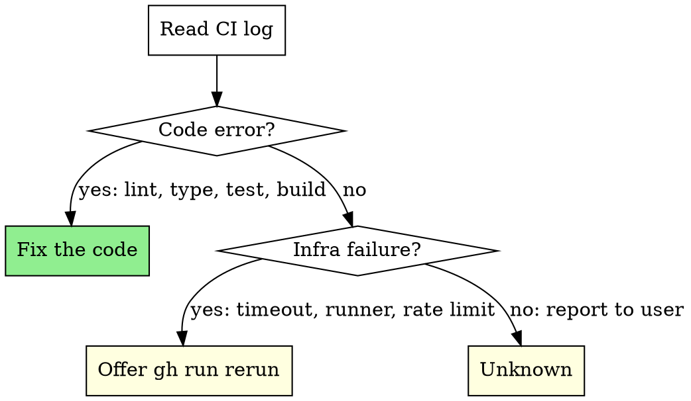

# pr-fix — Phase 2: Diagnose

For the selected item. If it's a **[PR]** item, run 2a-pre first, then 2a-2e.
If it's a **[CI]** item, skip to 2a-ci.

## 2a-pre: Supersession triage for stale PR items

On a high-velocity repo, the dominant failure mode of an open PR is not
"broken code" — it is "main moved past it". Measured 2026-08-22: of 9
`[PR-FAIL]`/`[PR-CONFLICT]` items aged 4–7 days, **8** resolved by
supersession evidence alone and 0 needed a code fix on their branch. Run
these cheap reads BEFORE opening a repair worktree on any item older than
~3 days:

```bash
# 1. Does main already satisfy the thing the PR exists to change?
#    Grep main for the failing assertion's expected string, the fix's
#    distinctive token, or the file state the PR creates.
git -C "$clone" fetch --quiet origin main
git -C "$clone" grep -n "<distinctive-token>" origin/main -- <paths>

# 2. Does the failing check pass on a NEWER PR / current main?
#    A machinery-fix PR whose target machinery is green elsewhere is done.
gh pr list --repo <org/repo> --state open --limit 5 \
  --json number,statusCheckRollup \
  --jq '.[] | {n:.number, fail:[.statusCheckRollup[] | select(.conclusion=="FAILURE") | .name]}'

# 3. How much unique content does the branch still carry?
git -C "$clone" fetch --quiet origin "refs/pull/<n>/head:refs/pr/<n>"
git -C "$clone" cherry origin/main "refs/pr/<n>"   # '+' = not upstream
```

Verdicts:

- **Superseded** (main satisfies the intent, or the machinery is green on
  newer PRs, or an add/add conflict shows main grew its own copy): recommend
  CLOSE with the evidence in the closing comment. Closing is reversible;
  never delete the branch in the same action.
- **Still wanted, conflicts only** (intent absent from main, few unique
  commits): proceed to the conflict/repair path.
- **Substantive unmerged work** (multiple unique commits main lacks): never
  close on age alone; report for manual rebase if conflicts are non-trivial.

Closing another author's PR is out of scope; supersession on someone else's
PR is report-only. Per `git-hygiene`, an EMPTY `git cherry` output is
inconclusive (it also describes an empty branch) — require at least one line
before reading it as containment.

## 2a: Get PR context

```bash
gh pr view <number> --repo <org/repo> \
  --json title,body,headRefName,baseRefName,url,additions,deletions,files
```

## 2b: Get failing check details

```bash
gh pr checks <number> --repo <org/repo>
```

Identify which check(s) failed. Prioritize required checks over non-required. Required-ness is **not** reliably fetchable here — most repos use **rulesets**, so `gh api repos/<org>/<repo>/branches/main/protection` returns 404 "Branch not protected" (verified code-search, 2026-06-16). Use `mergeStateStatus` (`UNSTABLE` = a non-required check failed but the PR is mergeable; `BLOCKED` = a required gate is unmet) instead of trying to resolve required contexts. There is no standing known-dead-checks list: the `mirror` entry was removed 2026-08-02 after that workflow went green (6/6 repos measured), because a name-based exclusion cannot tell a noisy check from a newly-broken one.

## 2c: Read CI failure logs

Extract run IDs directly from the failing checks (not `gh run list`, which can return a different workflow's run):

```bash
# Get run IDs from failing checks — the link field contains the exact run ID
gh pr checks <number> --repo <org/repo> \
  --json name,state,link \
  --jq '[.[] | select(.state == "FAILURE") | {name, run_id: (.link | capture("runs/(?<id>[0-9]+)") | .id)}] | unique_by(.run_id)'

# Read failure logs for each unique run ID. Redirect to a unique file first —
# piping `gh run view --log-failed` straight to `tail`/`head` trips the
# bash-tail-buffering guard (SIGPIPE to a long-running producer).
LOG_FILE=$(mktemp "${TMPDIR:-/tmp}/pr-fix-cilog-XXXXXX")
gh run view <run-id> --repo <org/repo> --log-failed > "$LOG_FILE" 2>&1
tail -80 "$LOG_FILE"

# If too noisy, filter for actionable lines (grep -m caps output without a `| head` pipe)
grep -a -m 30 -E "error|Error|FAIL|fatal" "$LOG_FILE"
```

## 2d: Classify the failure



**Code errors** (fixable): lint failures, type errors, test failures, build errors, import errors, syntax errors.

**Infrastructure failures** (rerun): runner timeouts, `Runner.Listener` errors, GitHub Actions outages, rate limits, network errors. Offer:

```bash
gh run rerun <run-id> --repo <org/repo> --failed
```

**Unknown**: Report the raw log excerpt and ask the user what to do. Do NOT guess.

**Reusable workflow failures**: If the CI job `uses:` a shared workflow
(e.g., `org/.github/.github/workflows/baseline-ci.yml@main`), read that
workflow's source BEFORE debugging the repo's config. The failure may be
in the shared workflow (version drift, missing `|| true`, changed flags),
not the repo's own files. Check `gh api repos/<org>/<repo>/contents/<path>`
for the workflow source.

**Gitleaks / secret scanning failures**: CI logs don't show which secrets
were flagged — findings are uploaded as SARIF artifacts. Instead of parsing
logs, search the repo's source files locally for common secret patterns
(`AKIA`, `BEGIN PRIVATE KEY`, `password=`, `api_key=`) and check
`.gitleaks.toml` allowlist coverage.

## 2e: Cosmetic-failure classification

Some failures are non-substantive and should be reclassified `[PR-COSMETIC]`
— the PR can safely merge via `--auto` even though the red check remains.

| Pattern in log | Why it's cosmetic | Action |
|---|---|---|
| `refusing to allow a GitHub App to create or update workflow ... without workflows permission (enablePullRequestAutoMerge)` | The failing job is the **dependabot auto-merge workflow itself**, not a substantive check. Dependabot's bot token lacks `workflows` scope for GHA-bumping PRs. | Queue `gh pr merge --auto --squash --delete-branch` under your own token (bare `--auto` on merge-queue repos like `claude-config`) — that token has `workflows` scope, so merge succeeds when required checks pass. |
| Pre-existing CI breakage unrelated to the diff (same failure on `main`) | The PR didn't introduce the failure; fixing it is a separate task. | Flag to user with "CI broken independently of PR — merge as-is?" option; do NOT attempt to fix in this skill. |
| Only non-required checks failing and all required checks passing | Branch protection already ignores these | Queue `--auto`; the non-required failure won't block the merge. |
| Only failing check is a workflow you have **verified is permanently retired** (its workflow file is deleted, or it is `state: disabled_manually` in `gh api repos/<r>/actions/workflows`) | Points at a dead workflow that will never pass and gates nothing | Classify `[PR-COSMETIC]`; queue `--auto` (or merge directly on an unprotected repo). **Verify retirement per-run — do not carry a hardcoded name list.** `mirror` was on this list until 2026-08-02; it was never retired, only broken, and it has since been fixed (#1774) and measured green 6/6. |

To detect the pre-existing-breakage case: compare the PR's failure against the latest workflow run for the same workflow on `main`. If main is also failing the same way, it's pre-existing.

## 2a-ci: Get commit CI context (for [CI] items only)

```bash
# Read failure logs directly using the run ID(s) from discovery. Redirect to
# a file — piping `gh run view --log-failed` to `tail`/`head` trips the
# bash-tail-buffering guard.
LOG_FILE=$(mktemp "${TMPDIR:-/tmp}/pr-fix-cilog-XXXXXX")
gh run view <run-id> --repo <org/repo> --log-failed > "$LOG_FILE" 2>&1
tail -80 "$LOG_FILE"

# If too noisy, filter for actionable lines (grep -m caps without a `| head` pipe)
grep -a -m 30 -E "error|Error|FAIL|fatal" "$LOG_FILE"

# Get the commit that triggered the failure
gh run view <run-id> --repo <org/repo> --json headSha,headBranch,event,name,conclusion
```

Then classify using the same 2d flowchart (code error / infra failure / unknown).
Remove only the unique `$LOG_FILE` after its excerpt and failure signature are
no longer needed.
