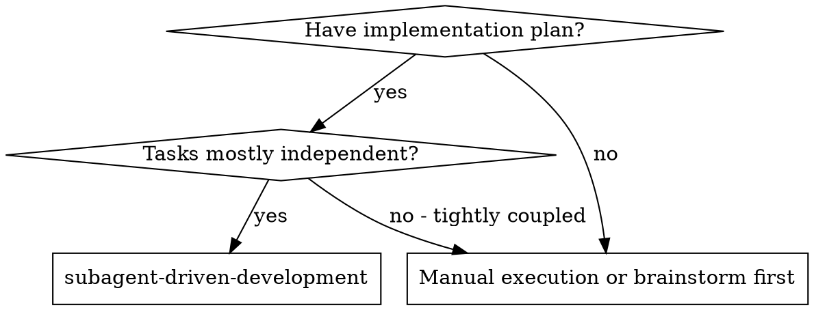

> **Compaction continuity:** Claude Code reattaches only the first 5,000
> tokens of an invoked skill after compaction, within a 25,000-token shared
> newest-first budget. If compaction occurs, re-invoke this skill before
> continuing; if model invocation is disabled, stop and ask the user to invoke
> it. Do not rely on tail instructions until the full body is restored.


# Subagent-Driven Development

Execute a plan with fresh subagents and a review budget proportional to the real risk.

**Why subagents:** You delegate tasks to specialized agents with isolated context. By precisely crafting their instructions and context, you ensure they stay focused and succeed at their task. They should never inherit your session's context or history — you construct exactly what they need. This also preserves your own context for coordination work.

**Core principle:** Fresh context helps only when review work is bounded. Review the complete vertical slice once; do not turn adjacent observations into an unlimited repair loop.

> **Runtime policy:** Dispatch is determined by this workflow's task graph and
> risk tier, not a model-era default. Record the effective model per
> `../_shared/model-runtime-policy.md`.

## When to Use



**Approach:**
- Same session (no context switch)
- Fresh subagent per task (no context pollution)
- Risk-based review with a fixed repair budget
- Faster iteration (no human-in-loop between tasks)

## The Process

**Review efficiency gate:** freeze a task-wide acceptance matrix before dispatch. Each reviewer
must inspect the bounded task surface and return one complete issue set, not one adjacent defect
per cycle. Do not poll active agents repeatedly; wait for their completion notification or use one
bounded wait, and review a vertical slice rather than each micro-commit.

### Risk-based review

Classify the completed vertical slice before review:

- **Source, documentation, or test-only:** implementer self-review plus the relevant focused check.
- **Normal product code:** one combined spec-and-quality reviewer.
- **Production mutation or security boundary:** separate spec and quality reviewers, in that order.

For any reviewer path, collect one complete issue set, make one repair batch, and perform one
re-review. A second rejection stops the task with the remaining blockers and returns control to the
user; it must not automatically start another repair agent or widen the acceptance matrix.

Do not dispatch a final whole-implementation reviewer when the same final diff has already passed
the selected review path and the integration gate. Additional observations become backlog unless
they expose data loss, unauthorized mutation, a security boundary bypass, or a false terminal claim.

### Bounded process

1. Freeze the acceptance matrix and risk tier.
2. Dispatch one implementer per independent task.
3. Run focused checks and implementer self-review.
4. Apply the review path above to the complete vertical slice.
5. If required, repair once and re-review once.
6. Run the plan's integration gate once, then ship or report the terminal blocker.

## Model Selection

Use the least powerful model that can handle each role to conserve cost and increase speed.

**Mechanical implementation tasks** (isolated functions, clear specs, 1-2 files): use a fast, cheap model. Most implementation tasks are mechanical when the plan is well-specified.

**Integration and judgment tasks** (multi-file coordination, pattern matching, debugging): use a standard model.

**Architecture, design, and review tasks**: use the most capable available model.

**Task complexity signals:**
- Touches 1-2 files with a complete spec → cheap model
- Touches multiple files with integration concerns → standard model
- Requires design judgment or broad codebase understanding → most capable model

## Handling Implementer Status

Implementer subagents report one of four statuses. Handle each appropriately:

**DONE:** Proceed to spec compliance review.

**DONE_WITH_CONCERNS:** The implementer completed the work but flagged doubts. Read the concerns before proceeding. If the concerns are about correctness or scope, address them before review. If they're observations (e.g., "this file is getting large"), note them and proceed to review.

**NEEDS_CONTEXT:** The implementer needs information that wasn't provided. Provide the missing context and re-dispatch.

**BLOCKED:** The implementer cannot complete the task. Assess the blocker:
1. If it's a context problem, provide more context and re-dispatch with the same model
2. If the task requires more reasoning, re-dispatch with a more capable model
3. If the task is too large, break it into smaller pieces
4. If the plan itself is wrong, escalate to the human

**Never** ignore an escalation or force the same model to retry without changes. If the implementer said it's stuck, something needs to change.

**Scope-change barrier:** When the user narrows, replaces, or cancels work, interrupt active agents and inventory every queued file, external, and live action. Reclassify each action against the new scope, cancel out-of-scope work, and do not resume mutations until the controller has reconciled the scope ledger.

## Prompt Templates

- `./implementer-prompt.md` - Dispatch implementer subagent
- `./spec-reviewer-prompt.md` - Dispatch spec compliance reviewer subagent
- `./code-quality-reviewer-prompt.md` - Dispatch per-task code quality reviewer subagent
- `./code-reviewer.md` - Combined reviewer template for normal product code

## Example Workflow

```
You: I'm using Subagent-Driven Development to execute this plan.

[Read plan file once: docs/superpowers/plans/feature-plan.md]
[Extract the tasks with full text and context]
[Create tasks via TaskCreate]

Task 1: Hook installation script

[Get Task 1 text and context (already extracted)]
[Dispatch implementation subagent with full task text + context]

Implementer: "Before I begin - should the hook be installed at user or system level?"

You: "User level (~/.config/superpowers/hooks/)"

Implementer: "Got it. Implementing now..."
[Later] Implementer:
  - Implemented install-hook command
  - Added tests, 5/5 passing
  - Self-review: Found I missed --force flag, added it
  - Committed

[Classify as normal product code]
[Dispatch one combined spec-and-quality reviewer]
Reviewer: ❌ Complete issue set:
  - Missing: Progress reporting (spec says "report every 100 items")
  - Extra: Added --json flag (not requested)

[Implementer makes one repair batch]
Implementer: Removed --json flag, added progress reporting; focused tests pass

[Same reviewer performs one re-review]
Reviewer: ✅ Approved

[Run the integration gate once and mark the task complete]

Done!
```

## Advantages

**vs. Manual execution:**
- Subagents follow TDD naturally
- Fresh context per task (no confusion)
- Parallel-safe (subagents don't interfere)
- Subagent can ask questions (before AND during work)

**vs. Executing Plans:**
- Same session (no handoff)
- Continuous progress (no waiting)
- Review checkpoints automatic

**Efficiency gains:**
- No file reading overhead (controller provides full text)
- Controller curates exactly what context is needed
- Subagent gets complete information upfront
- Questions surfaced before work begins (not after)

**Quality gates:**
- Self-review catches issues before handoff
- Review depth matches the task's risk
- One bounded repair and re-review verifies fixes without open-ended tuning
- Spec compliance prevents over/under-building
- Code quality ensures implementation is well-built

**Cost:**
- At most one reviewer for normal code and two for production/security boundaries
- Controller does more prep work (extracting all tasks upfront)
- One repair cycle may add an iteration

## Red Flags

**Never:**
- Start implementation on main/master branch without explicit user consent
- Skip the review path selected by the frozen risk tier
- Proceed with unfixed issues
- Run two implementer subagents concurrently on the same files or overlapping scope (conflicts). Disjoint-scope concurrency is allowed — see Example 2 for the tests-and-implementation split, where the two subagents touch separate paths.
- Make subagent read plan file (provide full text instead)
- Skip scene-setting context (subagent needs to understand where task fits)
- Ignore subagent questions (answer before letting them proceed)
- Accept "close enough" on a blocking spec or security finding
- Expand the acceptance matrix during re-review
- **Start code quality review before spec compliance is ✅** (wrong order)
- Move to next task while either review has open issues

**If subagent asks questions:**
- Answer clearly and completely
- Provide additional context if needed
- Don't rush them into implementation

**If reviewer finds issues:**
- Implementer (same subagent) fixes them
- Reviewer re-reviews the complete repair batch once
- If it rejects again, stop and report the remaining blockers

**If subagent fails task:**
- Dispatch fix subagent with specific instructions
- Don't try to fix manually (context pollution)

## Integration

**Required workflow skills:**
- Use `isolation: "worktree"` on Task tool calls for isolated workspaces
- **superplan** - Creates the plan this skill executes
- Code review is handled by CI (0 required approvals, auto-merge on check pass)
- Use `/ship` to commit, push, and merge after all tasks complete

**Subagents should use:**
- **test-driven-development** - Subagents follow TDD for each task

**Plan source:**
- **/superplan** - Produces the plan this skill executes against. Sunset note: prior `/writing-plans` and `/executing-plans` skills were retired 2026-05-03; /superplan is the successor for plan creation, and this skill is the successor for plan execution.

## Per-Subagent Worktree Isolation

By default this skill targets **independent** tasks (see "When to Use"): the
"Tasks mostly independent?" gate steers tightly-coupled, shared-state work to
manual execution because two subagents Editing/Writing concurrently share the
session's single working tree and HEAD — a shared-HEAD race that can corrupt
git state or clobber each other's changes.

**Opt-in escape hatch:** set the environment variable
`SUBAGENT_WORKTREE_ISOLATION=1` before dispatching. When set, the
`pre-agent-dispatch` hook provisions a **dedicated git worktree per writing
subagent** and injects a "work only in this worktree" instruction into the
agent:

- **Branch:** `claude/<session>-agent-<n>` (per-session, per-agent index)
- **Location:** under `~/.claude/worktrees/` — the same root the `work` skill
  and `worktree-enforcement.py` recognize as isolated (so the existing
  `.claude/worktrees/` detection treats these writes as already-isolated; no
  separate `isolation: "worktree"` flag is needed on the Task call).
- **Write-intent gate:** only agents whose prompt indicates Edit/Write work get
  a worktree; pure read/research agents are left un-isolated (cheap to skip).
- **Budget cap:** at most `MAX_PARALLEL_SUBAGENT_WORKTREES` (currently 8)
  concurrent per-subagent worktrees are provisioned; past the cap the hook
  fails open to a normal (un-isolated) dispatch rather than blocking.
- **Cleanup:** on subagent stop, `subagent-stop.py` GCs any worktree that has
  **no** changes vs. its base ref (removes the worktree + deletes the throwaway
  branch). A worktree with commits/changes is **left in place and flagged** on
  stderr so the orchestrator can merge/ship the branch deliberately.

**Effect on the coupling constraint:** with `SUBAGENT_WORKTREE_ISOLATION=1`,
the "Do NOT use for tightly-coupled tasks that share state" guidance is
**relaxed** — file-level isolation gives each writing agent its own HEAD, so
parallel agents touching related code no longer race on the shared working
tree. (You still want disjoint *file* scopes when the goal is a clean merge;
isolation removes the git-HEAD hazard, not the logical merge-conflict one.)

**Default-off contract:** when `SUBAGENT_WORKTREE_ISOLATION` is unset (the
default), no worktree is created and dispatch/stop behavior is identical to
this skill's normal flow. The feature is fully opt-in and fail-open: any git
or provisioning failure proceeds with the normal un-isolated dispatch.

## Examples

**Example 1: Implement a multi-file feature**
User says: "Implement the plan from superplan"
Actions: Reads the plan, breaks it into atomic tasks. Dispatches fresh subagent per task with explicit file scope constraints. Each subagent implements one piece. Main session reviews `git diff --stat` after each return, verifies expected files were changed, catches scope violations.
Result: Feature implemented across 4 files, each verified individually, single commit with all changes.

**Example 2: Parallel implementation with review**
User says: "Build the new MCP server endpoints — tests and implementation in parallel"
Actions: Dispatches 2 agents — one writes tests (TDD style, red tests), one writes implementation. After both return, main session runs tests to verify green. If failures, dispatches a fix agent with the test output.
Result: Implementation + tests delivered, verified green, ready to ship.

## Success Criteria

- Each task dispatched to a fresh subagent with clear scope and output requirements
- Risk-based review applied to the completed vertical slice
- No more than one repair batch and one re-review
- Subagent status responses (DONE, DONE_WITH_CONCERNS, NEEDS_CONTEXT, BLOCKED) handled appropriately
- All file changes verified on disk after subagent returns (read the modified files in the orchestrator before marking the task complete; subagent reports alone are insufficient)
- No task marked complete based solely on subagent report
